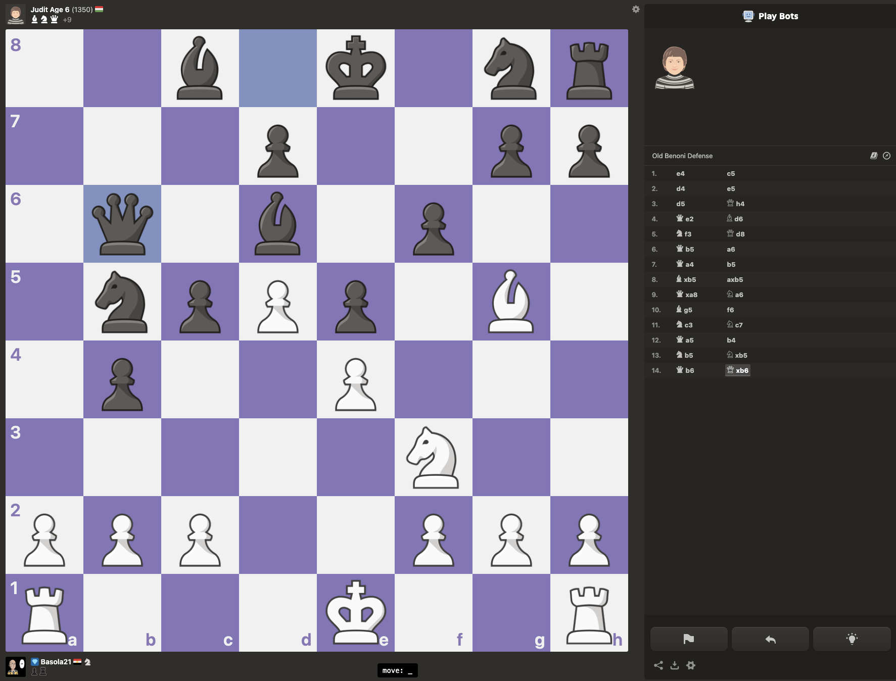
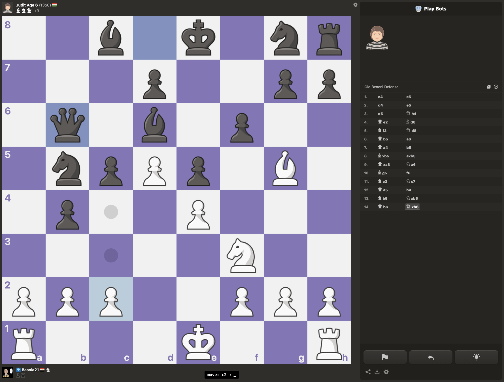

<div align="center">
  
  <h1>TypeChess</h1>
  <p>A browser extension for chess.com — play by typing moves, no mouse needed</p>
</div>

---

```
k  →  e2  →  e4
```

Press `k`, type the square your piece is on, type where it's going. That's it.

---

## Screenshots





---

## Why

**Learning chess notation** — most beginners learn notation passively by reading game recaps. TypeChess forces you to actively recall it every move. After a few games you'll never need to look at the board coordinates again.

**Keyboard-only play** — no mouse required. If you spend your day on a keyboard and find switching to the mouse disruptive, this is for you.

---

## Install

Clone or download this repo, then follow the steps for your browser.

**Firefox**
1. Go to `about:debugging`
2. Click **This Firefox**
3. Click **Load Temporary Add-on**
4. Select the `manifest.json` file in the repo folder

> Note: temporary add-ons are removed when Firefox closes. To keep it permanently, [submit it to the Firefox Add-ons store](https://addons.mozilla.org/developers/).

**Chrome**
1. Go to `chrome://extensions`
2. Enable **Developer mode** (top right toggle)
3. Click **Load unpacked**
4. Select the repo folder

> Note: to keep it permanently across updates, [submit it to the Chrome Web Store](https://chrome.google.com/webstore/devconsole) (one-time $5 fee).

---

## How to use

| Keys | What happens |
|------|-------------|
| `k` | Start a move |
| `e2` | Select the piece on e2 (chess.com highlights valid moves) |
| `e4` | Move it to e4 |
| `Backspace` | Delete last character |
| `Escape` | Cancel and reset |

The status bar at the bottom of the screen shows your input as you type:

```
move: e2  →  e_
```

---

## Not a vim plugin

TypeChess is keyboard-driven but has nothing to do with vim. The only thing it borrows is the idea that your hands shouldn't have to leave the keyboard.
